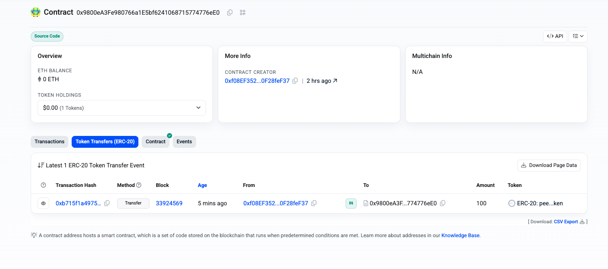

# Day 2: Smart Contracts & Custom Tokens on Base Sepolia

Transitioning from sending simple transactions to **programming the network**. We built a smart contract and, because we lacked testnet USDC, we minted our own currency (`peUSDC`) to power the ecosystem.

## What We Did

1.  **Initialized a Hardhat Project:** Set up the industry-standard development environment for Ethereum.
2.  **Wrote `AgentAllowance.sol`:** Created a "Vault" contract that holds funds and allows authorized agents to withdraw them (Pull Payment pattern).
3.  **Wrote `peekaloToken.sol`:** Created a custom ERC20 token (mock USDC) to act as the currency for our vault.
4.  **Deployed to Base Sepolia:** Pushed both the Currency and the Vault to the live testnet.
5.  **Verified Source Code:** Solved Etherscan API V2 deprecation issues to verify the contract on BaseScan.
6.  **Funded the Vault:** Bypassed a UI glitch by interacting directly with the blockchain explorer to load the vault with 100 peUSDC.

## Prerequisites

  * **Hardhat** (Development Framework)
  * **OpenZeppelin Contracts** (Standard Secure Libraries)
  * **Etherscan API Key** (For verification)
  * **Base Sepolia ETH** (For gas fees)

## How to Run

1.  **Install Dependencies:**

    ```bash
    npm install
    ```

2.  **Configure Environment:**
    Update `.env` to include the verification key.

    ```env
    PRIVATE_KEY="YOUR_PRIVATE_KEY"
    ETHERSCAN_API_KEY="YOUR_ETHERSCAN_API_KEY" # Required for verification
    ```

3.  **Compile Contracts:**

    ```bash
    npx hardhat compile
    ```

4.  **Deploy (Token + Vault):**

    ```bash
    npx hardhat run scripts/deployToken.ts --network baseSepolia
    ```

5.  **Verify Contract:**
    ```bash
    npx hardhat verify --network baseSepolia <VAULT_ADDRESS> <TOKEN_ADDRESS>
    ```

6. **Verify Token:**
    ```bash
    npx hardhat verify --network baseSepolia <TOKEN_ADDRESS>
    ```

## Key Learnings

### 1\. The "Empty Vault" Problem

  * **Challenge:** We built a vault to hold USDC, but we had zero testnet USDC in our wallet. You cannot load a machine with air.
  * **Solution (God Mode):** We deployed a simple ERC20 contract (`peekaloToken`) that minted **1,000,000 peUSDC** to our wallet upon deployment. We then pointed the Vault to accept this specific custom currency.

### 2\. Web3 Model

  * **Web2:** Money sits in a user's account database.
  * **Web3:** Money lives in the Token Contract (`0x5986...`). The Vault Contract (`0x9800...`) holds logic. The User Wallet (`0xf08e...`) holds keys. The interaction involves the Vault acting as a puppet master to ask the Token Contract to move funds.

### 3\. Hardhat Verification Issue

  * **Error:** `Missing chainid parameter`
  * **Cause:** Hardhat's default verification plugin was fighting with the new Etherscan V2 API requirements.
  * **Fix:** It's a silly mistake from my end, it should have been https://api.etherscan.io/v2/api?chainid=84532& and i missed the & symbol at the end.

## Proof of Work

**Currency (peekaloToken):** [0x59866D6285BB0A22275016cbAA7199780D273D93](https://sepolia.basescan.org/address/0x59866D6285BB0A22275016cbAA7199780D273D93)
**Vault (AgentAllowance):** [0x9800eA3Fe980766a1E5bf6241068715774776eE0](https://sepolia.basescan.org/address/0x9800eA3Fe980766a1E5bf6241068715774776eE0#code)



**Status:** ✅ Verified & Funded (100 peUSDC balance visible on-chain).